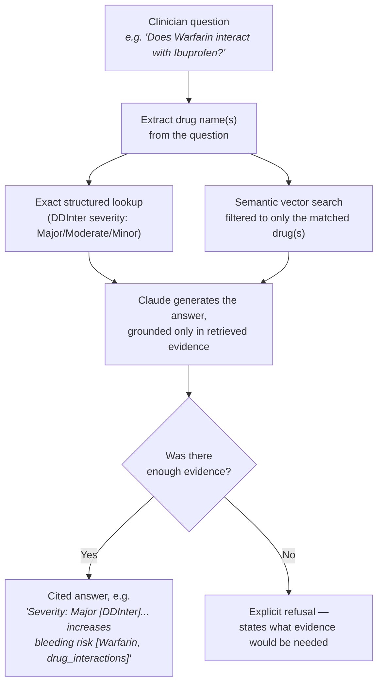
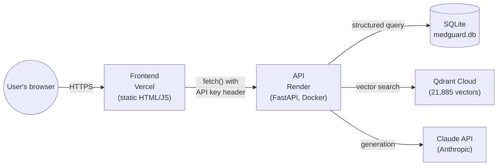

# MedGuard RAG — Drug Interaction & Dosage Clinical Decision Support

**🔗 Live demo: [medguard-rag.vercel.app](https://medguard-rag.vercel.app)**
*(free-tier backend — first request after inactivity may take up to ~50s to wake up)*

A Retrieval-Augmented Generation (RAG) system that answers drug interaction
and dosage questions by combining a structured drug-interaction database
with real FDA drug label text — every answer grounded in cited evidence,
never a bare model guess.

> **Intended use:** clinical reference / decision-support tool for licensed
> professionals. This is **not** a substitute for professional medical
> judgment, and is not intended for direct patient use.

---

## Table of contents

- [Why this project exists](#why-this-project-exists)
- [Scope — what it can and can't answer](#scope--what-it-cant-answer)
- [How it works](#how-it-works)
- [Technology used](#technology-used)
- [Trying it yourself](#trying-it-yourself)
- [Data sources](#data-sources)
- [Key engineering decisions](#key-engineering-decisions)
- [Deployment](#deployment)
- [Running it locally](#running-it-locally)
- [Project status](#project-status)
- [Disclaimer](#disclaimer)

---

## Why this project exists

Ask a general-purpose AI model "does warfarin interact with ibuprofen?" and
it will usually answer from memory — sounding confident whether or not it's
actually right. For a healthcare question, that's not good enough: a
plausible-sounding wrong answer is worse than no answer at all.

This project exists to show a different approach. Instead of answering from
memory, the system:

1. **Looks up real evidence first** — a curated drug-interaction database
   and actual FDA-approved drug label text
2. **Only then writes an answer**, and every claim in that answer is tied
   back to a specific source
3. **Says "I don't know" when it should** — if the evidence isn't there, the
   system explicitly says so instead of guessing

That third point turned out to be the hardest part to get right, and it's
the thing worth trying first if you're evaluating this project (see the
example questions below).

## Scope — what it can and can't answer

This is a portfolio project built on a **deliberately limited slice** of
real data, not a comprehensive drug database. Understanding the boundary is
important — a question landing outside it is expected behavior, not a bug.

**In scope:** drugs in DDInter's "blood and blood-forming organs" category
(anticoagulants like warfarin, antiplatelets, related agents) and any drug
in that category with an FDA label indexed by openFDA. **822 drugs** have
real label text loaded; **1,503 drugs** have structured interaction data.

**Out of scope:** anything outside that category — most antibiotics,
antidepressants (a few common ones like sertraline made it in via
interaction overlap, but coverage isn't comprehensive), diabetes
medications, and so on. Asking about a drug outside scope should produce a
clear refusal explaining what's missing, not a hallucinated answer. See
[Trying it yourself](#trying-it-yourself) for a worked example.

Also excluded on purpose: **combination products** (e.g. a pill combining
three active ingredients) are filtered out of the label corpus, because
their warnings describe the combination as a whole, not any single
ingredient — see [engineering decisions](#key-engineering-decisions) below.

## How it works



The two retrieval paths matter for different reasons: the **structured
lookup** gives a reliable, curated severity rating; the **vector search**
finds the actual FDA label passages that explain *why* — mechanism,
monitoring guidance, management recommendations. Combining them is what
lets the system answer both "how severe" and "what should I know" questions
from real sources rather than guessing at either.

## Technology used

| Layer | Technology | Why |
|---|---|---|
| Structured data | SQLite + SQLAlchemy | Simple, portable, holds the DDInter interaction table |
| Unstructured data | openFDA REST API | Official, free, public-domain FDA label text |
| Embeddings | [fastembed](https://github.com/qdrant/fastembed) (`BAAI/bge-small-en-v1.5`) | Lightweight ONNX runtime — see engineering decisions for why this replaced PyTorch |
| Vector search | [Qdrant](https://qdrant.tech) | Purpose-built vector database, hybrid filtering support |
| Generation | Claude API (Anthropic) | Grounded generation with a strict citation-and-refusal system prompt |
| Backend | FastAPI | Typed, auto-documented REST API |
| Frontend | Plain HTML/CSS/JS | No framework — a single static file, deliberately simple |
| Evaluation | [Ragas](https://github.com/explodinggradients/ragas) | Faithfulness, answer relevancy, context precision/recall scoring |
| Containerization | Docker + Docker Compose | One-command local startup of all services |
| Hosting | Vercel (frontend) · Render (API) · Qdrant Cloud (vectors) | All free-tier |

## Trying it yourself

Open the [live demo](https://medguard-rag.vercel.app) and try both an
in-scope and an out-of-scope question to see the contrast:

**In scope — expect a cited, structured answer:**
```
Does Warfarin interact with Ibuprofen?
What are the contraindications for Warfarin?
Does Sertraline cause serotonin syndrome?
```

**Out of scope — expect an explicit, explained refusal (not a guess):**
```
Can I take Amoxicillin with birth control?
```
(Amoxicillin isn't in this project's indexed category — the system says so
rather than answering from general training knowledge.)

**Nonsense input — also tests the refusal path:**
```
Does this drug interact with kryptonite?
```

There's a toggle for **"Retrieval only"** mode, which shows the raw matched
evidence without spending an API call on generation — useful for inspecting
what the system actually found before it writes an answer.

## Data sources

| Source | What it provides | License / access |
|---|---|---|
| [DDInter 2.0](https://ddinter2.scbdd.com) | 15,140 structured drug-drug interaction records (severity: Minor/Moderate/Major/Unknown) across 1,503 drugs, category B (blood/blood-forming organs) | Free, academic; original DDInter release is CC-BY-NC-SA — **non-commercial use only** |
| [openFDA](https://open.fda.gov) | Official FDA drug label text — boxed warnings, contraindications, dosage & administration, drug interactions | Free, public domain, no key required (optional free key raises rate limits) |

**Why category B specifically:** blood/anticoagulant interactions (e.g.
warfarin) are among the most clinically significant and well-documented DDI
categories, giving the project real-world relevance without requiring the
full 8-category, 300K+ row dataset for a v1.

## Key engineering decisions

These are the deliberate, documented tradeoffs made in this project — real
decisions and real bugs found along the way, not a cleaned-up retelling.

- **Combination products are excluded from the FDA label corpus.** A
  multi-ingredient product's label (e.g. Triumeq = abacavir + dolutegravir +
  lamivudine) documents warnings for the *combination*, not any single
  ingredient — attributing that text to just one drug would misattribute
  clinical reasoning. Detected via `openfda.substance_name` count > 1.
- **Structured pair normalization.** Every interaction pair is stored with
  the smaller internal drug ID as `drug_a_id`, so a `UniqueConstraint`
  reliably catches (A,B)/(B,A) duplicates regardless of source ordering.
- **Chunking never crosses label sections.** A `drug_interactions` chunk
  never blends into `dosage_and_administration` — they answer different
  clinical questions and mixing them blurs retrieval precision.
- **Sentence-aware chunking with overlap**, not fixed character splitting —
  avoids severing a clause from its subject mid-sentence.
- **fastembed over sentence-transformers/PyTorch for embeddings.** The
  project originally used `sentence-transformers` locally — reproducible and
  free, but PyTorch alone uses 400-600MB+ just importing, which crashed the
  first production deployment on Render's free tier (512MB cap). Switched to
  `fastembed` (Qdrant's own ONNX-based runtime, same `BAAI/bge-small-en-v1.5`
  model) for a dramatically smaller memory footprint, then re-embedded the
  full corpus so query-time and stored vectors are generated by the same
  backend — avoiding any precision-mismatch risk from mixing embedding
  libraries. Still local/free/no API key required, just lighter.
- **Qdrant Cloud requires an explicit payload index for filtering** that
  local self-hosted Qdrant doesn't strictly enforce (it falls back to a
  slower full scan instead). Hybrid retrieval's drug-scoped filtering worked
  locally but failed in production until a payload index was added on
  `drug_id` — now created automatically by the ingestion pipeline for any
  fresh setup, local or cloud.
- **Hybrid retrieval, not pure vector search.** Drug interactions are
  look-up-table facts as much as narrative text; pure semantic search alone
  would risk hallucinating on "does X interact with Y" when it should be a
  deterministic lookup. Structured DDInter lookup + drug-filtered semantic
  search over FDA text run together.
- **Idempotent ingestion scripts throughout** — fetch, chunk, and embed
  steps all skip already-processed records, so any step can be safely
  re-run or resumed after an interruption without duplicating data or
  re-spending API quota.

Full narrative of bugs found and fixed (with reasoning) is in
[`docs/engineering-notes.md`](docs/engineering-notes.md).

## Deployment



| Layer | Host | Notes |
|---|---|---|
| Frontend | [Vercel](https://vercel.com) | Static `frontend/index.html`, no build step |
| API | [Render](https://render.com) | Deployed from `Dockerfile` using `requirements-api.txt` (minimal deps — no PyTorch) |
| Vector store | [Qdrant Cloud](https://cloud.qdrant.io) | Free tier (1GB), migrated from local via `migrate_to_cloud.py` snapshot export/import |

To migrate a local Qdrant collection to a cloud cluster yourself:
```bash
python3 migrate_to_cloud.py   # prompts for your cluster URL, reads QDRANT_API_KEY from .env
```

Deployed API environment variables (set in Render's dashboard, never committed):
`ANTHROPIC_API_KEY`, `QDRANT_URL`, `QDRANT_API_KEY`, `DATABASE_URL`, `CLAUDE_MODEL`, `APP_API_KEY`.

`APP_API_KEY` is an optional shared-secret header required on `/query` — a
deterrent against casual bots burning API credits on a public demo, not real
authentication (the frontend is static HTML, so the key is visible in
client-side source to anyone who looks).

## Running it locally

**Quickest path — one command via Docker Compose** (recommended):

```bash
cp .env.example .env   # fill in ANTHROPIC_API_KEY
docker compose up --build
```

This builds and starts all three services — Qdrant, the FastAPI backend, and
the frontend — wired together automatically. Open `http://localhost:8080`
once it's running.

Note: the ingestion pipeline (fetching ~800 real FDA labels, chunking, and
embedding ~22,000 chunks) takes significant time on first run due to
external API rate limits. A populated `data/processed/medguard.db` is
committed to this repo specifically so you don't have to wait for that —
`qdrant_storage/` is not committed (large, binary, regenerated by
`embed_chunks.py` against the already-populated database in minutes).

**Manual / local dev path** (running each service directly, without Docker):

```bash
# 1. Environment
cp .env.example .env   # fill in ANTHROPIC_API_KEY, optionally QDRANT_API_KEY

# 2. Dependencies
pip3 install -r requirements.txt

# 3. Vector store
docker run -d --name medguard-qdrant -p 6333:6333 -p 6334:6334 \
  -v "$(pwd)/qdrant_storage:/qdrant/storage" qdrant/qdrant

# 4. Ingestion pipeline (run once, in order)
python3 -m app.ingestion.load_ddinter data/raw/ddinter_downloads_code_B.csv
python3 -m app.ingestion.fetch_openfda
python3 -m app.ingestion.chunk_labels
python3 -m app.ingestion.embed_chunks

# 5. Run the backend
uvicorn app.api.main:app --reload --port 8000

# 6. Open the frontend
open frontend/index.html   # or serve it however you prefer

# Optional: raw retrieval testing without the API
python3 search_repl.py                    # raw semantic search
python3 -m app.retrieval.hybrid_search     # hybrid structured + semantic retrieval
```

## Project status

- [x] Structured data: DDInter loaded (15,140 interactions, 1,503 drugs)
- [x] Unstructured data: openFDA fetch complete (822 real FDA labels, 116
      combination products correctly excluded, 512 not found — mostly OTC
      minerals/electrolytes without prescription-style labels)
- [x] Chunking pipeline: sentence-aware, markup-stripped, section-scoped
      (21,885 chunks total)
- [x] Vector store: Qdrant populated and validated (21,885 embedded points)
- [x] Hybrid retrieval: structured + drug-filtered semantic search working
- [x] Claude API generation layer with mandatory citations and graceful
      refusal on insufficient evidence
- [x] Ragas evaluation suite (faithfulness, answer relevancy, context
      precision/recall — see `docs/eval_report*.csv` and
      `docs/engineering-notes.md` for findings)
- [x] FastAPI backend (`/query`, `/search`, `/interactions`, `/health`) with
      optional shared-secret protection on cost-incurring endpoints
- [x] Custom clinical-grade frontend (static HTML/JS, no framework)
- [x] Docker Compose bundling Qdrant + API + frontend, one-command startup
- [x] Live public deployment (Vercel + Render + Qdrant Cloud)
- [ ] MCP server wrapper (FastAPI only so far — a natural v2 extension)
- [ ] CI pipeline (lint/test/eval-regression gate)

## Disclaimer

This is a portfolio/educational project. It is not FDA-approved, not a
medical device, and should never be used as the sole basis for a clinical
decision. Always verify against current, authoritative sources.
